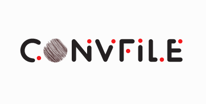

  

<h1 align="center">Converter File</h1>

API serves to convert multimedia files and documents.

 
Descrição da API de Conversão de Áudio, Vídeo, Imagem e Documento

A API de Conversão é uma solução abrangente que permite aos desenvolvedores converter arquivos de áudio, vídeo, imagem e documento para diferentes formatos. Com as tecnologias FFmpeg e Sharp integradas, a API oferece recursos avançados para manipular e transformar diversos tipos de arquivos multimídia.

Principais Tecnologias Utilizadas:
- FFmpeg: Uma biblioteca poderosa e amplamente utilizada para manipulação de áudio e vídeo. O FFmpeg oferece funcionalidades abrangentes, como conversão de formatos, ajuste de qualidade, corte, redimensionamento, aplicação de filtros, entre outros.
- Sharp: Uma biblioteca versátil para processamento de imagens em Node.js. O Sharp permite redimensionar, recortar, aplicar filtros, ajustar cores e converter imagens para diferentes formatos.

Recursos da API:
1. Conversão de Áudio:
   - Suporte para diversos formatos de áudio de entrada, como MP3, WAV, FLAC, entre outros.
   - Conversão para formatos comumente utilizados, como MP3, AAC, OGG, entre outros.
   - Ajuste de parâmetros de áudio, como taxa de bits, frequência de amostragem e canais.
   - Recorte de trechos específicos de áudio.

2. Conversão de Vídeo:
   - Suporte para uma ampla variedade de formatos de vídeo de entrada, como MP4, AVI, MOV, entre outros.
   - Conversão para formatos populares, como MP4, WEBM, AVI, entre outros.
   - Redimensionamento de vídeos para tamanhos personalizados.
   - Recorte de partes específicas de vídeos.
   - Aplicação de filtros, efeitos e ajustes de vídeo durante a conversão.

3. Conversão de Imagem:
   - Suporte para vários formatos de imagem, incluindo PNG, JPEG, GIF, entre outros.
   - Redimensionamento de imagens para dimensões específicas.
   - Recorte de áreas específicas da imagem.
   - Aplicação de filtros e efeitos de imagem durante a conversão.
   - Conversão de formatos de imagem, permitindo a saída em diferentes extensões.

4. Conversão de Documento:
   - Suporte para diferentes formatos de documentos, como DOCX, PDF, ODT, entre outros.
   - Conversão para formatos populares, como PDF, DOCX, ODT, entre outros.
   - Extração de texto e conteúdo de documentos.
   - Manipulação de metadados e informações do documento.

Benefícios e Casos de Uso:
- Flexibilidade: A API oferece uma ampla gama de opções de conversão, permitindo personalizar os parâmetros conforme necessário.
- Integração Simplificada: Com uma interface intuitiva e documentação detalhada, a API pode ser facilmente integrada a diferentes projetos e sistemas existentes.
- Suporte a Múltiplos Formatos: A API suporta uma variedade de formatos de entrada e saída, garantindo compatibilidade com diferentes tipos de arquivos multimídia.
- Escalabilidade: A API é projetada para lidar com um grande volume de solicitações de conversão de forma eficiente e escalável.
- Casos de Uso Comuns: Os casos de uso